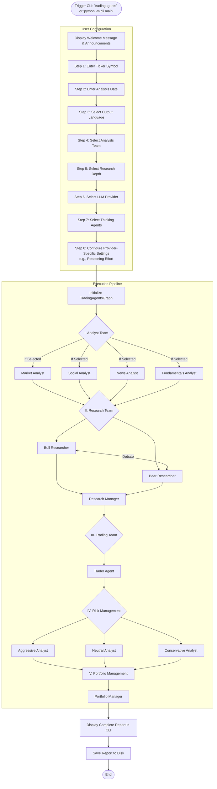

# TradingAgents CLI Flowchart

This document outlines the step-by-step flow of the TradingAgents CLI from the moment it is triggered until the final report is generated.

## Description of Stages

1. **User Configuration**: The CLI prompts the user for various parameters required for the analysis, such as the target stock ticker, the date of analysis, the LLM provider to use, and which specific analyst agents to include.
2. **Execution Pipeline**: The core logic powered by `TradingAgentsGraph` runs. It follows a sequential flow where the output of one team feeds into the next.
   - **Analyst Team**: Gathers raw data and generates initial reports based on the selected agents.
   - **Research Team**: Engages in a debate between bullish and bearish perspectives, finalized by the Research Manager.
   - **Trading Team**: The Trader formulates an investment plan based on the research.
   - **Risk Management**: Evaluates the trader's plan from different risk perspectives.
   - **Portfolio Management**: Makes the final decision to approve or reject the trade.
3. **Output**: The final comprehensive report is displayed in the terminal and saved to the local disk in organized markdown files.
